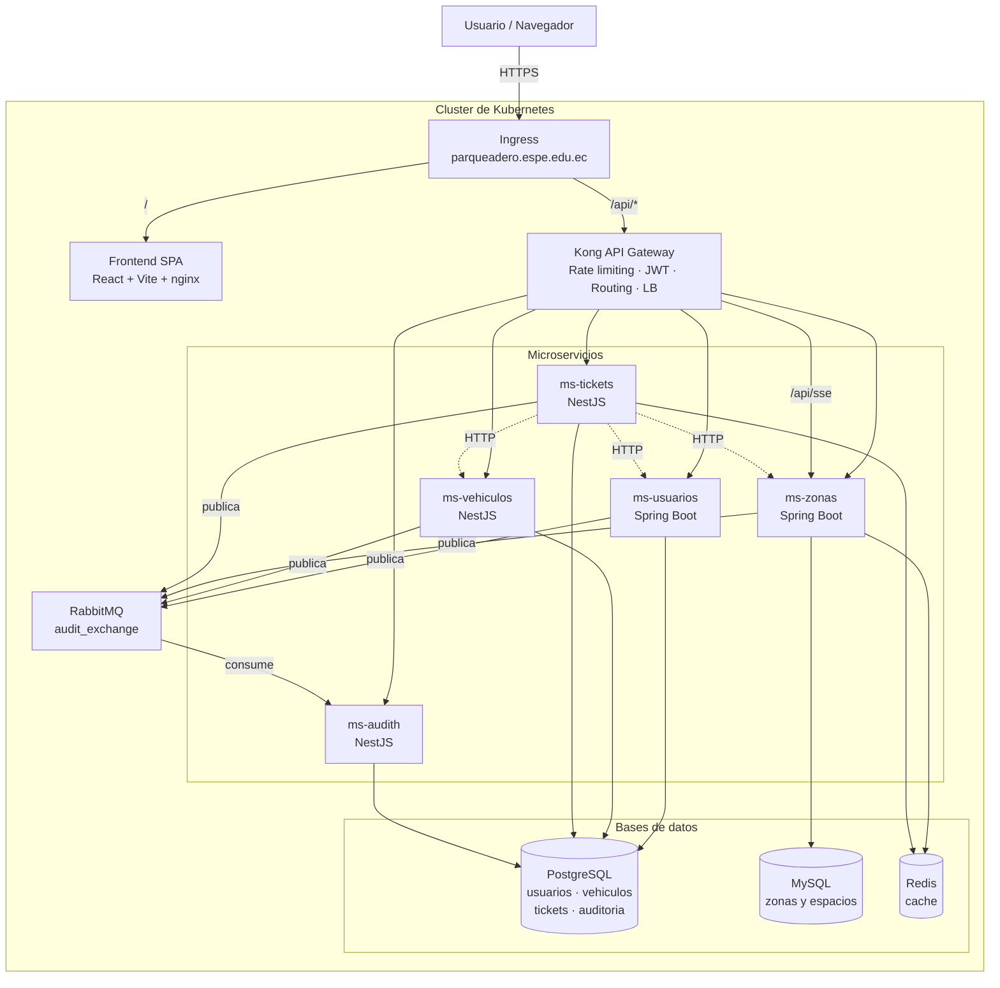
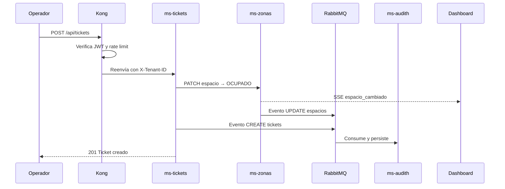

# Arquitectura del sistema

Sistema de gestión de parqueaderos bajo arquitectura de microservicios, modelo
SaaS multitenant. Cada tenant es una empresa independiente que opera sobre la
misma infraestructura compartida con sus datos aislados.

## Vista general



## Microservicios

| Servicio | Stack | Puerto | Base de datos | Responsabilidad |
|---|---|---|---|---|
| `ms-usuarios` | Spring Boot 4 / Java 21 | 8080 | PostgreSQL `usuarios_db` | Usuarios, personas, roles, RBAC y emisión de JWT |
| `ms-vehiculos` | NestJS 11 | 3000 | PostgreSQL `vehiculos_db` | Catálogo de vehículos por tenant |
| `ms-zonas` | Spring Boot 4 / Java 21 | 8082 | MySQL `db_zonas_espacios` | Zonas, espacios, estados de ocupación y stream SSE |
| `ms-tickets` | NestJS 11 | 3000 | PostgreSQL `tickets_db` | Entrada, salida y cobro de vehículos |
| `ms-audith` | NestJS 11 | 3004 | PostgreSQL `db_audit` | Registro centralizado de eventos |

Cada servicio tiene su propio `Dockerfile` y su propia base de datos: ningún
servicio consulta las tablas de otro.

## Multitenancy

El aislamiento se sostiene en tres capas que se validan de forma independiente:

1. **Identificación.** Cada petición lleva la cabecera `X-Tenant-ID`. El
   frontend la deriva del subdominio (`empresa-a.parqueadero.espe.edu.ec`), de
   `?tenant=` o de la última selección guardada.
2. **Vinculación al token.** El JWT emitido por `ms-usuarios` incluye el claim
   `tenant_id`. Si el token no coincide con la cabecera, el servicio responde
   403: un token de una empresa no sirve contra otra.
3. **Filtrado en consulta.** Todos los repositorios filtran por `tenant_id`
   (`findAllByTenantId`, `findByTenantIdAndId`, …). No hay consulta de negocio
   sin tenant en el `WHERE`.

En Java el tenant vive en un `ThreadLocal` (`TenantContext`) que fija
`TenantContextFilter` al inicio de la petición y limpia al terminar. En NestJS
lo resuelve `JwtAuthGuard`, que lo deja en `request.tenantId`.

`TenantContext.normalize` aplica el mismo formato en todos los servicios:
`^[a-z0-9][a-z0-9-]{1,49}$`.

## API Gateway (Kong)

`App/kong.yml` es la única fuente de verdad. Docker Compose la monta como
volumen; Kubernetes la consume desde el ConfigMap que genera
`k8s/sync-kong-config.py`.

| Responsabilidad | Implementación |
|---|---|
| Enrutamiento | `services` + `routes` por microservicio |
| Balanceo de carga | `upstreams` con targets, sondeo activo TCP (reincorpora los que vuelven) y pasivo HTTP (circuit breaker) |
| Autenticación | Plugin `jwt` en todas las rutas salvo `/api/auth` |
| Rate limiting | Global 120/min y 3000/hora; `/api/auth` limitado a 10/min contra fuerza bruta |
| Transformación | `request-transformer` y `correlation-id` (`X-Correlation-ID` para trazar entre servicios) |
| CORS | Dominio productivo y orígenes de desarrollo |

### Validación del JWT en el gateway

El plugin `jwt` localiza el consumer por el claim `iss` del token
(`key_claim_name: iss`). Por eso `JwtTokenProvider` firma con
`iss = parqueadero-auth`, que coincide con el `key` del consumer declarado en
`kong.yml`, y fija el algoritmo a **HS256** de forma explicita. Si se dejara que
jjwt lo dedujera del largo de la clave, cambiar `JWT_SECRET` podria pasarlo a
HS384 o HS512 en silencio y Kong rechazaria todos los tokens.

El secreto no se escribe en `kong.yml`: el archivo guarda el marcador
`__JWT_SECRET__`, que se sustituye por el valor de `JWT_SECRET` al arrancar el
contenedor —en el entrypoint con Compose, en un initContainer con Kubernetes—.
No sirve una referencia de vault (`{vault://env/...}`) porque el campo `secret`
de `jwt_secrets` no es *referenceable* en el esquema de Kong: se guardaria tal
cual y la firma nunca validaria. Asi el gateway y los microservicios comparten
una sola fuente de verdad, y el ConfigMap no contiene credenciales.

### Rutas publicadas

| Ruta | Destino | Protegida |
|---|---|---|
| `/api/auth/*` | `ms-usuarios` | No (rate limit estricto) |
| `/api/users`, `/api/personas`, `/api/v1/roles` | `ms-usuarios` | Sí |
| `/api/zonas`, `/api/espacios` | `ms-zonas` | Sí |
| `/api/sse` | `ms-zonas` → `/api/espacios/sse` | Sí |
| `/api/vehiculos` | `ms-vehiculos` | Sí |
| `/api/tickets` | `ms-tickets` | Sí |
| `/api/ticket-events` | `ms-tickets` → `/sse` | Sí |
| `/api/audit`, `/api/auditoria` | `ms-audith` | Sí |

## Mensajería y auditoría

Los cuatro microservicios de negocio publican eventos de dominio en el exchange
tópico `audit_exchange` (durable) con la routing key `audit_routing_key`.
`ms-audith` consume desde `audit_queue` y los persiste.



La publicación es **resiliente**: si RabbitMQ no está disponible se registra el
error y la operación de negocio continúa. La auditoría no debe poder tumbar una
entrada de vehículo.

Cada evento registra quién, qué, cuándo y desde dónde: usuario autenticado,
acción, entidad, tenant, marca de tiempo, IP y MAC.

**Vocabulario de acciones:** `CREATE`, `UPDATE`, `DELETE`, `READ`, unificado en
los cuatro publicadores para que el panel pueda filtrar de forma coherente.

## Tiempo real (SSE)

`ms-zonas` mantiene un `SseEmitter` por conexión, **agrupado por tenant**: un
operador solo recibe los cambios de su empresa.

La API `EventSource` del navegador no permite enviar cabeceras propias, así que
el stream transporta tenant y token por query string:

```
GET /api/sse?tenant_id=empresa-a&jwt=<token>
```

Tanto el plugin `jwt` de Kong (`uri_param_names: [jwt]`) como
`JwtAuthenticationFilter` de `ms-zonas` leen el token desde ahí.

El buffering se desactiva en las tres capas —Ingress (`proxy-buffering: off`),
Kong (`X-Accel-Buffering: no`) y nginx del frontend— porque cualquiera de ellas
retendría los eventos hasta llenar su buffer.

### Limitación conocida

Los emisores SSE viven **en la memoria del pod**. Con más de una réplica de
`ms-zonas`, un navegador queda conectado a un solo pod y no recibe los eventos
que genera otra réplica. Por eso `ms-zonas` y `ms-tickets` están fijados en 1
réplica y quedan fuera del HPA.

Para escalarlos hay que difundir los eventos entre réplicas mediante un exchange
`fanout` al que se suscriba cada pod y reemita a sus emisores locales. La
infraestructura de mensajería ya está desplegada; falta ese fan-out.

## Seguridad

- **Todo el tráfico externo pasa por Kong**, que valida el JWT antes de que la
  petición alcance cualquier microservicio. Los servicios lo validan otra vez:
  el gateway no es el único control.
- **RBAC**: los `GET` los puede hacer cualquier usuario autenticado; el resto
  de métodos exige rol `ADMIN`.
- **Secrets en Kubernetes** para JWT, credenciales de base de datos y RabbitMQ.
- **El puerto Admin de Kong escucha en loopback** y no se expone como Service:
  la configuración es inmutable y proviene del ConfigMap.
- **TLS** en el Ingress, con redirección de HTTP a HTTPS.

> Los valores de `k8s/02-secret.yaml` están en claro **solo para la demo
> académica**. En un despliegue real deben crearse fuera de Git.

## Cache

| Servicio | Instancia | Qué cachea | TTL |
|---|---|---|---|
| `ms-zonas` | `redis-zonas` | Lista de espacios (`espacios:all`) | 60 s |
| `ms-tickets` | `redis-tickets` | Validaciones de persona y vehículo | 60 s |

El cache de espacios se invalida en cada cambio (crear, actualizar, eliminar o
cambiar estado), de modo que el dashboard nunca muestra ocupación obsoleta.

## Escalabilidad

`k8s/40-hpa.yaml` escala automáticamente por CPU y memoria:

| Componente | Réplicas | Motivo |
|---|---|---|
| `kong` | 2 – 5 | Stateless |
| `frontend` | 2 – 4 | Stateless |
| `ms-usuarios` | 2 – 6 | Stateless |
| `ms-vehiculos` | 2 – 6 | Stateless |
| `ms-audith` | 2 – 8 | Competing consumers sobre la misma cola |
| `ms-zonas` | 1 fija | Emisores SSE en memoria |
| `ms-tickets` | 1 fija | Emisores SSE en memoria |

Incorporar un tenant nuevo no requiere redesplegar: basta con crear sus datos,
ya que el aislamiento es lógico (columna `tenant_id`) y no por instancia.

## Documentación de la API

Cada microservicio publica su contrato OpenAPI 3:

| Servicio | Swagger UI | Contrato |
|---|---|---|
| `ms-usuarios` | `:8080/swagger-ui.html` | `:8080/v3/api-docs` |
| `ms-zonas` | `:8082/swagger-ui.html` | `:8082/v3/api-docs` |
| `ms-vehiculos` | `:3001/docs` | `:3001/docs-json` |
| `ms-tickets` | `:3002/docs` | `:3002/docs-json` |
| `ms-audith` | `:3004/docs` | `:3004/docs-json` |

## Decisiones de diseño

**Una base de datos por microservicio.** Cada servicio es dueño de su esquema.
El acoplamiento es por API o por evento, nunca por tabla compartida.

**Multitenancy por columna discriminadora, no por esquema.** Un esquema por
tenant obligaría a migrar N esquemas en cada cambio y a redesplegar al
incorporar una empresa. La columna `tenant_id` mantiene el alta de tenants como
una operación de datos.

**La auditoría es asíncrona.** Si fuese una llamada síncrona, una caída de
`ms-audith` bloquearía las operaciones de negocio. Con RabbitMQ los eventos se
acumulan en la cola y se procesan cuando el consumidor vuelve.

**Kong valida el JWT aunque los servicios también lo hagan.** El gateway
rechaza el tráfico no autenticado antes de consumir recursos de los
microservicios; la validación interna protege frente a llamadas laterales
dentro del clúster.
